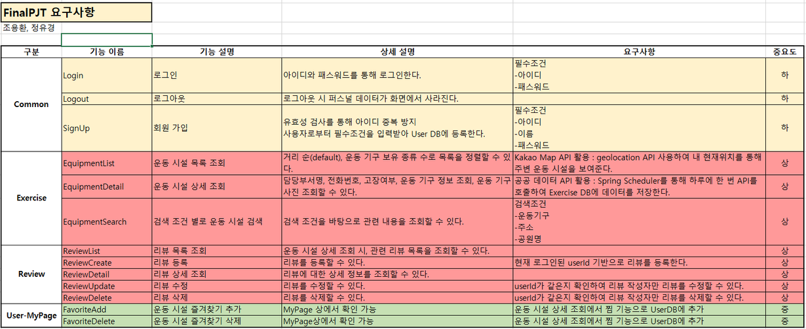
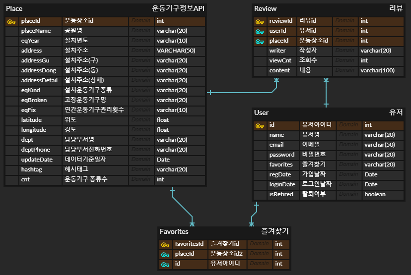
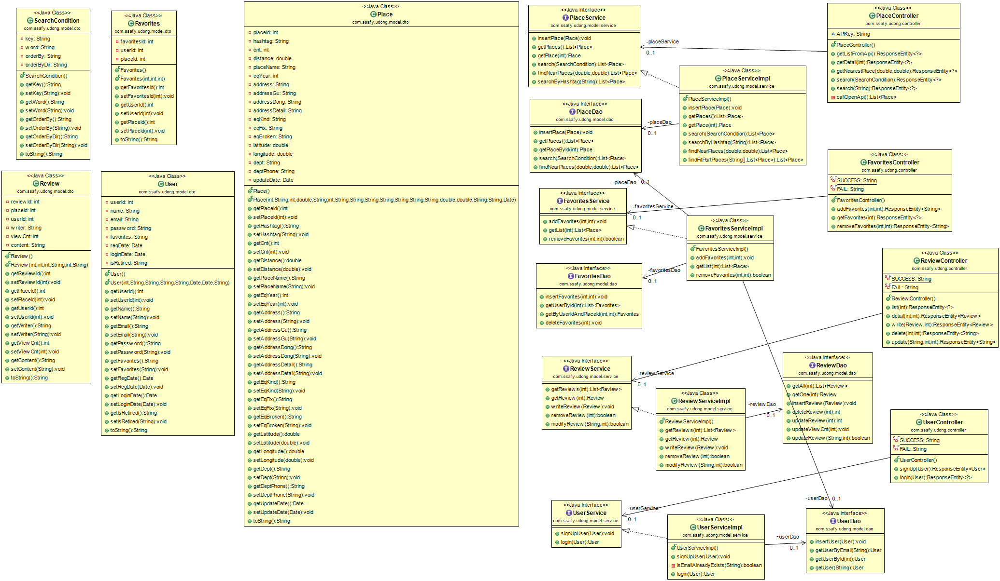
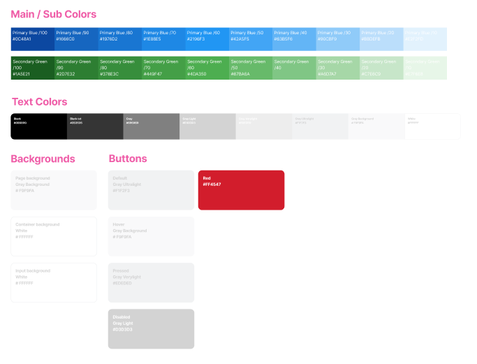

    # 우리 동네 무료 헬스장 🏋️‍♀️🏋️‍♂️
팀장: 조용환(FE), 팀원: 정유경(BE)

### 1. Commit & PR Rules
```
태그: 내용

ex) 특정 파일 혹은 기능을 버그를 수정했을 때

git commit -m "Fix: regist.vue - fix login"
```


| 태그 |	설명 |
|----------|--------------|
| Comment | 필요한 주석 추가 및 변경 |
| Design | Css 적용 및 디자인 관련 수정 |
| Docs | 문서 수정(README.md 포함) |
| Error | 오류로 인한 상황시 |
| Feat | 새로운 기능 및 파일 추가 |
| Fix | 버그 수정 |
| Rename | 파일 혹은 폴더명을 수정하거나 옮기는 작업만인 경우 |
| Remove | 파일을 삭제하는 작업만 수행한 경우 |
<br/>

### 2. 요구사항 정의서



### 3. 테이블 구조도(ERD)


### 4. 클래스 다이어그램


### 5. 화면 설계서<br />



### 6. 프로젝트 구조<br />
<details>
<summary>BACKEND 자료 구조</summary>
<br />
📦spring-final-pjt<br />
 ┣ 📂src<br />
 ┃ ┣ 📂main<br />
 ┃ ┃ ┣ 📂java<br />
 ┃ ┃ ┃ ┗ 📂com<br />
 ┃ ┃ ┃ ┃ ┗ 📂ssafy<br />
 ┃ ┃ ┃ ┃ ┃ ┗ 📂udong<br />
 ┃ ┃ ┃ ┃ ┃ ┃ ┣ 📂config<br />
 ┃ ┃ ┃ ┃ ┃ ┃ ┃ ┣ 📜DBConfig.java<br />
 ┃ ┃ ┃ ┃ ┃ ┃ ┃ ┣ 📜SwaggerConfig.java<br />
 ┃ ┃ ┃ ┃ ┃ ┃ ┃ ┗ 📜WebConfig.java<br />
 ┃ ┃ ┃ ┃ ┃ ┃ ┣ 📂controller<br />
 ┃ ┃ ┃ ┃ ┃ ┃ ┃ ┣ 📜FavoritesController.java<br />
 ┃ ┃ ┃ ┃ ┃ ┃ ┃ ┣ 📜PlaceController.java<br />
 ┃ ┃ ┃ ┃ ┃ ┃ ┃ ┣ 📜ReviewController.java<br />
 ┃ ┃ ┃ ┃ ┃ ┃ ┃ ┗ 📜UserController.java<br />
 ┃ ┃ ┃ ┃ ┃ ┃ ┣ 📂model<br />
 ┃ ┃ ┃ ┃ ┃ ┃ ┃ ┣ 📂dao<br />
 ┃ ┃ ┃ ┃ ┃ ┃ ┃ ┃ ┣ 📜FavoritesDao.java<br />
 ┃ ┃ ┃ ┃ ┃ ┃ ┃ ┃ ┣ 📜PlaceDao.java<br />
 ┃ ┃ ┃ ┃ ┃ ┃ ┃ ┃ ┣ 📜ReviewDao.java<br />
 ┃ ┃ ┃ ┃ ┃ ┃ ┃ ┃ ┗ 📜UserDao.java<br />
 ┃ ┃ ┃ ┃ ┃ ┃ ┃ ┣ 📂dto<br />
 ┃ ┃ ┃ ┃ ┃ ┃ ┃ ┃ ┣ 📜Favorites.java<br />
 ┃ ┃ ┃ ┃ ┃ ┃ ┃ ┃ ┣ 📜Place.java<br />
 ┃ ┃ ┃ ┃ ┃ ┃ ┃ ┃ ┣ 📜Review.java<br />
 ┃ ┃ ┃ ┃ ┃ ┃ ┃ ┃ ┣ 📜SearchCondition.java<br />
 ┃ ┃ ┃ ┃ ┃ ┃ ┃ ┃ ┗ 📜User.java<br />
 ┃ ┃ ┃ ┃ ┃ ┃ ┃ ┗ 📂service<br />
 ┃ ┃ ┃ ┃ ┃ ┃ ┃ ┃ ┣ 📜FavoritesService.java<br />
 ┃ ┃ ┃ ┃ ┃ ┃ ┃ ┃ ┣ 📜FavoritesServiceImpl.java<br />
 ┃ ┃ ┃ ┃ ┃ ┃ ┃ ┃ ┣ 📜PlaceService.java<br />
 ┃ ┃ ┃ ┃ ┃ ┃ ┃ ┃ ┣ 📜PlaceServiceImpl.java<br />
 ┃ ┃ ┃ ┃ ┃ ┃ ┃ ┃ ┣ 📜ReviewService.java<br />
 ┃ ┃ ┃ ┃ ┃ ┃ ┃ ┃ ┣ 📜ReviewServiceImpl.java<br />
 ┃ ┃ ┃ ┃ ┃ ┃ ┃ ┃ ┣ 📜UserService.java<br />
 ┃ ┃ ┃ ┃ ┃ ┃ ┃ ┃ ┗ 📜UserServiceImpl.java<br />
 ┃ ┃ ┃ ┃ ┃ ┃ ┗ 📜UdongHealthApplication.java<br />
 ┃ ┃ ┗ 📂resources<br />
 ┃ ┃ ┃ ┣ 📂mappers<br />
 ┃ ┃ ┃ ┃ ┣ 📜favoritesMapper.xml<br />
 ┃ ┃ ┃ ┃ ┣ 📜placeMapper.xml<br />
 ┃ ┃ ┃ ┃ ┣ 📜reviewMapper.xml<br />
 ┃ ┃ ┃ ┃ ┗ 📜userMapper.xml<br />
 ┃ ┃ ┃ ┣ 📜application.properties<br />
 ┃ ┃ ┃ ┗ 📜sql.sql<br />
 ┃ ┗ 📂test<br />
 ┃ ┃ ┗ 📂java<br />
 ┃ ┃ ┃ ┗ 📂com<br />
 ┃ ┃ ┃ ┃ ┗ 📂ssafy<br />
 ┃ ┃ ┃ ┃ ┃ ┗ 📂udong<br />
 ┃ ┃ ┃ ┃ ┃ ┃ ┗ 📜UdongHealthApplicationTests.java<br />
 ┣ 📂target<br />
 ┃ ┣ 📂classes<br />
 ┃ ┃ ┣ 📂com<br />
 ┃ ┃ ┃ ┗ 📂ssafy<br />
 ┃ ┃ ┃ ┃ ┗ 📂udong<br />
 ┃ ┃ ┃ ┃ ┃ ┣ 📂config<br />
 ┃ ┃ ┃ ┃ ┃ ┃ ┣ 📜DBConfig.class<br />
 ┃ ┃ ┃ ┃ ┃ ┃ ┣ 📜SwaggerConfig.class<br />
 ┃ ┃ ┃ ┃ ┃ ┃ ┗ 📜WebConfig.class<br />
 ┃ ┃ ┃ ┃ ┃ ┣ 📂controller<br />
 ┃ ┃ ┃ ┃ ┃ ┃ ┣ 📜FavoritesController.class<br />
 ┃ ┃ ┃ ┃ ┃ ┃ ┣ 📜PlaceController.class<br />
 ┃ ┃ ┃ ┃ ┃ ┃ ┣ 📜ReviewController.class<br />
 ┃ ┃ ┃ ┃ ┃ ┃ ┗ 📜UserController.class<br />
 ┃ ┃ ┃ ┃ ┃ ┣ 📂model<br />
 ┃ ┃ ┃ ┃ ┃ ┃ ┣ 📂dao<br />
 ┃ ┃ ┃ ┃ ┃ ┃ ┃ ┣ 📜FavoritesDao.class<br />
 ┃ ┃ ┃ ┃ ┃ ┃ ┃ ┣ 📜PlaceDao.class<br />
 ┃ ┃ ┃ ┃ ┃ ┃ ┃ ┣ 📜ReviewDao.class<br />
 ┃ ┃ ┃ ┃ ┃ ┃ ┃ ┗ 📜UserDao.class<br />
 ┃ ┃ ┃ ┃ ┃ ┃ ┣ 📂dto<br />
 ┃ ┃ ┃ ┃ ┃ ┃ ┃ ┣ 📜Favorites.class<br />
 ┃ ┃ ┃ ┃ ┃ ┃ ┃ ┣ 📜Place.class<br />
 ┃ ┃ ┃ ┃ ┃ ┃ ┃ ┣ 📜Review.class<br />
 ┃ ┃ ┃ ┃ ┃ ┃ ┃ ┣ 📜SearchCondition.class<br />
 ┃ ┃ ┃ ┃ ┃ ┃ ┃ ┗ 📜User.class<br />
 ┃ ┃ ┃ ┃ ┃ ┃ ┗ 📂service<br />
 ┃ ┃ ┃ ┃ ┃ ┃ ┃ ┣ 📜FavoritesService.class<br />
 ┃ ┃ ┃ ┃ ┃ ┃ ┃ ┣ 📜FavoritesServiceImpl.class<br />
 ┃ ┃ ┃ ┃ ┃ ┃ ┃ ┣ 📜PlaceService.class<br />
 ┃ ┃ ┃ ┃ ┃ ┃ ┃ ┣ 📜PlaceServiceImpl$1.class<br />
 ┃ ┃ ┃ ┃ ┃ ┃ ┃ ┣ 📜PlaceServiceImpl.class<br />
 ┃ ┃ ┃ ┃ ┃ ┃ ┃ ┣ 📜ReviewService.class<br />
 ┃ ┃ ┃ ┃ ┃ ┃ ┃ ┣ 📜ReviewServiceImpl.class<br />
 ┃ ┃ ┃ ┃ ┃ ┃ ┃ ┣ 📜UserService.class<br />
 ┃ ┃ ┃ ┃ ┃ ┃ ┃ ┗ 📜UserServiceImpl.class<br />
 ┃ ┃ ┃ ┃ ┃ ┗ 📜UdongHealthApplication.class<br />
 ┃ ┃ ┣ 📂mappers<br />
 ┃ ┃ ┃ ┣ 📜favoritesMapper.xml<br />
 ┃ ┃ ┃ ┣ 📜placeMapper.xml<br />
 ┃ ┃ ┃ ┣ 📜reviewMapper.xml<br />
 ┃ ┃ ┃ ┗ 📜userMapper.xml<br />
 ┃ ┃ ┣ 📂META-INF<br />
 ┃ ┃ ┃ ┣ 📂maven<br />
 ┃ ┃ ┃ ┃ ┗ 📂com.ssafy<br />
 ┃ ┃ ┃ ┃ ┃ ┗ 📂UdongHealth<br />
 ┃ ┃ ┃ ┃ ┃ ┃ ┣ 📜pom.properties<br />
 ┃ ┃ ┃ ┃ ┃ ┃ ┗ 📜pom.xml<br />
 ┃ ┃ ┃ ┗ 📜MANIFEST.MF<br />
 ┃ ┃ ┣ 📜application.properties<br />
 ┃ ┃ ┗ 📜sql.sql<br />
 ┃ ┗ 📂test-classes<br />
 ┃ ┃ ┗ 📂com<br />
 ┃ ┃ ┃ ┗ 📂ssafy<br />
 ┃ ┃ ┃ ┃ ┗ 📂udong<br />
 ┃ ┃ ┃ ┃ ┃ ┗ 📜UdongHealthApplicationTests.class<br />
 ┣ 📜.classpath<br />
 ┣ 📜.gitignore<br />
 ┣ 📜.project<br />
 ┣ 📜mvnw<br />
 ┣ 📜mvnw.cmd<br />
 ┗ 📜pom.xml<br />
<br />
## 접은 제목<br />
접은 내용<br />
</details><br />

<details>
<summary>FRONTEND 자료 구조</summary>
📦vue-final-pjt <br>
 ┣ 📂.vscode <br>
 ┃ ┗ 📜extensions.json <br>
 ┣ 📂public <br>
 ┣ 📂src <br>
 ┃ ┣ 📂assets <br>
 ┃ ┃ ┣ 📂fit <br>
 ┃ ┃ ┃ ┣ 📜arm.png <br>
 ┃ ┃ ┃ ┣ 📜back.png <br>
 ┃ ┃ ┃ ┣ 📜belly.png <br>
 ┃ ┃ ┃ ┣ 📜body.png <br>
 ┃ ┃ ┃ ┣ 📜cardio.png <br>
 ┃ ┃ ┃ ┣ 📜chest.png <br>
 ┃ ┃ ┃ ┣ 📜endurance.png <br>
 ┃ ┃ ┃ ┣ 📜flexibility.png <br>
 ┃ ┃ ┃ ┣ 📜leg.png <br>
 ┃ ┃ ┃ ┣ 📜shoulder.png <br>
 ┃ ┃ ┃ ┣ 📜stretching.png <br>
 ┃ ┃ ┃ ┣ 📜upperBody.png <br>
 ┃ ┃ ┃ ┣ 📜waist.png <br>
 ┃ ┃ ┃ ┗ 📜weight.png <br>
 ┃ ┃ ┣ 📂복부 <br>
 ┃ ┃ ┃ ┣ 📜롤링웨이브.jpg <br>
 ┃ ┃ ┃ ┣ 📜롤스트레칭.jpg <br>
 ┃ ┃ ┃ ┣ 📜바디싣업.jpg <br>
 ┃ ┃ ┃ ┣ 📜옆파도타기.jpg <br>
 ┃ ┃ ┃ ┣ 📜윗몸일으키기.jpg <br>
 ┃ ┃ ┃ ┣ 📜트위스트.jpg <br>
 ┃ ┃ ┃ ┣ 📜허리돌리기.jpg <br>
 ┃ ┃ ┃ ┣ 📜허리등안마기.jpg <br>
 ┃ ┃ ┃ ┗ 📜허리스트레칭.jpg <br>
 ┃ ┃ ┣ 📂상체 <br>
 ┃ ┃ ┃ ┣ 📜바웨이트.jpg <br>
 ┃ ┃ ┃ ┣ 📜상체근육풀기.jpg <br>
 ┃ ┃ ┃ ┣ 📜어깨근육풀기.jpg <br>
 ┃ ┃ ┃ ┣ 📜역기내리기.jpg <br>
 ┃ ┃ ┃ ┣ 📜역기올리기.jpg <br>
 ┃ ┃ ┃ ┣ 📜터닝암.jpg <br>
 ┃ ┃ ┃ ┣ 📜트윈터닝암.jpg <br>
 ┃ ┃ ┃ ┣ 📜팔어깨근육풀기.jpg <br>
 ┃ ┃ ┃ ┣ 📜풀웨이트.jpg <br>
 ┃ ┃ ┃ ┗ 📜핸드웨이트.jpg <br>
 ┃ ┃ ┣ 📂하체 <br>
 ┃ ┃ ┃ ┣ 📜다리뻗기.jpg <br>
 ┃ ┃ ┃ ┣ 📜레그스트레칭.jpg <br>
 ┃ ┃ ┃ ┣ 📜레그프레스.jpg <br>
 ┃ ┃ ┃ ┣ 📜워킹싸이클론.jpg <br>
 ┃ ┃ ┃ ┣ 📜크로스워킹.jpg <br>
 ┃ ┃ ┃ ┗ 📜하늘걷기.jpg <br>
 ┃ ┃ ┣ 📜logo.png <br>
 ┃ ┃ ┣ 📜running.jpg <br>
 ┃ ┃ ┣ 📜walking.mp4 <br>
 ┃ ┃ ┣ 📜yhC.png <br>
 ┃ ┃ ┗ 📜ykC.png <br>
 ┃ ┣ 📂components <br>
 ┃ ┃ ┣ 📂common <br>
 ┃ ┃ ┃ ┣ 📜TheFavList.vue <br>
 ┃ ┃ ┃ ┣ 📜TheFooter.vue <br>
 ┃ ┃ ┃ ┣ 📜TheHeaderNav.vue <br>
 ┃ ┃ ┃ ┣ 📜TheKindCarousel.vue <br>
 ┃ ┃ ┃ ┣ 📜TheLecList.vue <br>
 ┃ ┃ ┃ ┣ 📜TheLoginForm.vue <br>
 ┃ ┃ ┃ ┣ 📜TheMastHead.vue <br>
 ┃ ┃ ┃ ┗ 📜TheSigninForm.vue <br>
 ┃ ┃ ┣ 📂review <br>
 ┃ ┃ ┃ ┣ 📜ReviewAddView.vue <br>
 ┃ ┃ ┃ ┣ 📜ReviewEditView.vue <br>
 ┃ ┃ ┃ ┗ 📜TheReviewList.vue <br>
 ┃ ┃ ┗ 📂search <br>
 ┃ ┃ ┃ ┣ 📜SearchFit.vue <br>
 ┃ ┃ ┃ ┗ 📜SearchPlace.vue <br>
 ┃ ┣ 📂router <br>
 ┃ ┃ ┗ 📜index.js <br>
 ┃ ┣ 📂stores <br>
 ┃ ┃ ┣ 📜place.js <br>
 ┃ ┃ ┗ 📜user.js <br>
 ┃ ┣ 📂views <br>
 ┃ ┃ ┣ 📜AboutView.vue <br>
 ┃ ┃ ┣ 📜HomeView.vue <br>
 ┃ ┃ ┣ 📜KindView.vue <br>
 ┃ ┃ ┣ 📜PlaceDetailView.vue <br>
 ┃ ┃ ┣ 📜SearchView.vue <br>
 ┃ ┃ ┗ 📜TheSignupView.vue <br>
 ┃ ┣ 📜App.vue <br>
 ┃ ┗ 📜main.js <br>
 ┣ 📜.env <br>
 ┣ 📜.gitignore <br>
 ┣ 📜index.html <br>
 ┣ 📜package-lock.json <br>
 ┣ 📜package.json <br>
 ┗ 📜vite.config.js <br>
</details>

### 7. 소스코드 및 DB 스크립트

<details>
<summary>FRONTEND 프로젝트 소스</summary>
<br />


</details>

<details>
<summary>BACKEND 프로젝트 소스</summary>
<br />

</details>